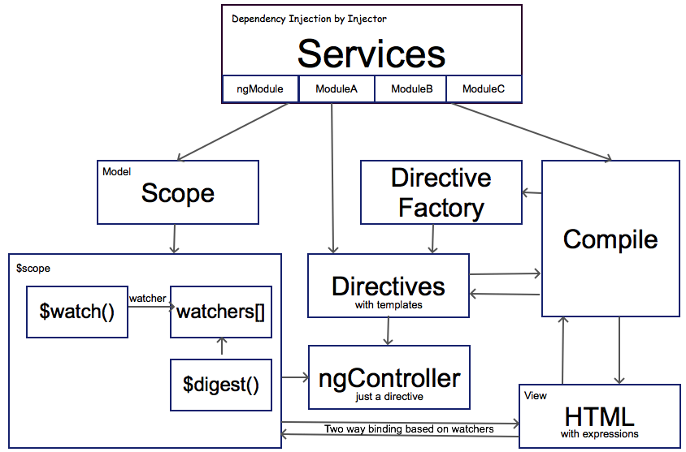
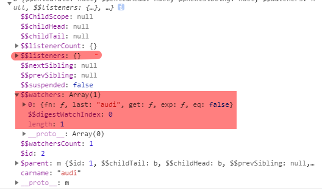

## scope作用域



Scope(作用域)是应用在HTML(视图)和javascript(控制器)之间的纽带
Scope是一个对象，有可用的属性和方法
Scope可应用在试图和控制器上

如何使用Scope
当你创建一个控制器时，你可以将$scope对象当作一个参数传递。

```html
<!DOCTYPE html>
<html lang="en">
<head>
    <meta charset="UTF-8">
    <meta name="viewport" content="width=device-width, initial-scale=1.0">
    <meta http-equiv="X-UA-Compatible" content="ie=edge">
    <title>scope</title>
</head>
<body>
    <div ng-app="myApp" ng-controller="myCtrl">
        <p>{{carname}}</p>
    </div>
</body>
<!-- 加载angularjs -->
<script src="../../lib/angular.min.js"></script>

<script>
    var myApp = angular.module('myApp', []);
    // 参数$scope中的属性对应了视图上的属性
    myApp.controller('myCtrl', ($scope) => { 
        $scope.carname = 'audi';
        console.log($scope)});
</script>
</html>
```

上面的实例中，在控制台中输出了`$scope`。


对照类图，可以看到`$scope`中的属性和方法。其中`$$watchers`是比较重要的。在图上可以看到视图中的属性carname。

## Scope概述
AngularJs的组成如下:
1. View(视图)，即HTML
2. Model(模型)，当前视图中可用的数据
3. Controller(控制器)，可以添加和修改属性;

其中，scope是模型，是一个Javascript对象，带有属性和方法，这些属性和方法可以在视图和控制器中使用。
```html
    <!-- 当视图修改了，模型和控制器也会修改 -->
    <div ng-app="myApp" ng-Controller="myCtrl">
        <span>carname:</span>
        <input type="text" ng-model="carname">
        <p>{{carname}}</p>
    </div>
```

## scope作用范围
了解你当前使用的scope是非常重要的
在大型的项目中,HTML DOM中有多个作用域时，这个时候就需要你清楚地了解你当前作用域是哪个作用域。
```html
<!DOCTYPE html>
<html lang="en">
<head>
    <meta charset="UTF-8">
    <meta name="viewport" content="width=device-width, initial-scale=1.0">
    <meta http-equiv="X-UA-Compatible" content="ie=edge">
    <title>scope</title>
</head>
<body>
    <div ng-app="myApp" ng-controller="myCtrl">
        <ul>
            <li ng-repeat='name in names'>{{name}}</li>
        </ul>
    </div>
</body>
<!-- 加载angularjs -->
<script src="../../lib/angular.min.js"></script>

<script>
    var myApp = angular.module('myApp', []);
    // 参数$scope中的属性对应了视图上的属性
    myApp.controller('myCtrl', ($scope) => $scope.names = ['wang2', 'zhang3', 'li4']);
</script>
</html>
```
当我们使用ng-repeat时，每个重复项都访问了当前的重复对象。
每个li元素都可以访问当前的重复对象，这里对应的是一个字符串，并使用变量x表示。

## 根作用域
所有的应用都有一个$rootScope,它可以作用在ng-app指令包含的所有HTML元素中。
$rootScope可作用在整个应用中，是各个controller中scope的桥梁。用rootScope定义的值，可以在各个controller中使用。
```html
<script>
    var myApp = angular.module('myApp', []);
    // 参数$scope中的属性对应了视图上的属性
    myApp.controller('myCtrl', ($scope, $rootScope) => {
        $scope.names = ['wang2', 'zhang3', 'li4'];
        $rootScope.lastname = 'Stark'});
</script>
```
创建控制器时，将`$rootScope`作为参数传递进去，就可在应用中使用。

## 补充内容来自《AnuglarJS高级编程》
### 1. 作用域继承

作用域继承将使用基于原型的继承方式继承它们的父作用域，并在`$parent`字段中保存父作用域的一个指针，所以子作用域可以访问父作用域中的变量。

作用域是非常强大的工具，如果说我们从蜘蛛侠中学到了什么，那就是能力越大，责任越大。使用AngularJS中，搬起石头砸自己的脚最常见的方式之一就是：尽管可以访问父作用域中的变量，但是AngularJS并不会允许为父作用域中变量赋值。

[传送门🚪](../src/html/inheritScope.html 'inherit Scope')

运行上面的实列时发现，尽管修改了英语输入框中的输入，但是西班牙文的输入并不会发生改变。这是因为ngModel可以读取父作用域的username的值，但是它只可以将值赋给当前的作用域。

为了解决上面的问题，可以通过`ngChange`来解决上面的问题。
```html
    <!-- 上加上ng-change='update(username)' -->
    <div ng-controller='languageController'>
        <div ng-controller='helloController' ng-repeat='language in languages'>
            ...
            <input type='text'
                ng-change='update(username)'
                ng-model='username'>
            ...
        </div>
    </div>
```

```js
    //languageController.js
    $scope.update = function(username) {
        $scope.username = username;
    }
```
[传送门🚪，关注注释部分](../src/html/inheritScope.html 'inherit Scope')

当然，AngularJS也支持禁用作用域继承。作用域可以标记为隔离的，这就意味着它不会继承父作用域。

另外一种常见的情况就是忘记在AngularJS表达式中无法访问全局window对象中的函数。
```html
    ...{{encodeURIComponent(url)}}...
```
上面的写法会报错。

解决方法是使用控制器来访问全局对象。
```js
    //XXXcontroller.js
    $scope.encodeURIComponent = window.encodeURIComponent;
```

但是如果需要在所有的控制器中加入`encodeURIComponent`，这样的方式是令人沮丧的。不要担心我们还有另一种方式可以访问`encodeURIComponent`。

除了存储数据，作用域还有三个重要的函数对数据绑定的工作方式是非常重要的。这些函数分别是`$watch`,`$apply`,`$digest`。

+ ### $watch

`$watch`组成了双向数据绑定的一边：通过它可以设置一个回调函数，在制定的表达式改变时调用。回调函数通常被引用为监视器。`$watch`的一个简单应用是每次用户名改变时更新firstname和lastname。

[传送门🚪](../src/html/$watch.html '$watch')

从内部看，`$watch`是一个普通的函数，每个作用域都维护了一个监视器列表，被称为`$scope.$$watchers`,`$watch`简单地添加了一些新的监视器，其中包含了一些内部记录，用于记录表达值的最后值。

+ ### $apply
`$apply`组成了双向数据绑定的另一边：它将通知AngularJS某些东西变了，`$watch`表达式的值应该重新计算。通常不需要自己调用`$apply`，因为AngularJS内置的指令(例如`ngClick`)和服务(例如`$timeout`)将会调用`$apply`。

最有可能在自定义事件处理程序的上下文中遇到的是`$apply`.当事件发生通知时，比如用户点击了按钮或者一个未完成的请求结束了，AnuglarJS需要得到通知，模型可能已经发生改变了。这样`ngClick`指令和`$http`服务会在内部调用`$apply`。

另一个例子是，当我们需要使用`$http`服务的替代品来请求某一个数据时，可能需要手动调用`$apply`,用于保证AngularJS已经注意到模型发生变化。

```html
    <div ng-controller='httpController'>
        <div>{{state}}</div>
        <div>{{result}}</div>
        <button type='submit' ng-click=''></button>
    </div>
```

```js
    function httpController($scope, $timeout) {
        $scope.state = 'loading';
        $scope.result = '';
        $scope.getData = function(url) {
            $.get(url, function (data) {
                $scope.state = 'ok';
                $scope.result = data;
                $scope.$apply();
            });
        }

        $timeout($scope.getData, 2000);
    }
```
当尝试着注释掉控制器中的`$scope.$apply();`时视图不会更新，当我们点击button时，视图更新了。
[传送门🚪](../src/html/$apply.html)

+ ### $digest
`$digest`是将`$watch`和`$apply`绑定在一起的魔法胶水函数。很难找到一个直接于其交互的例子。
具体内容请查看《AngularJS高级编程》Page 135,[传送门🚪]()